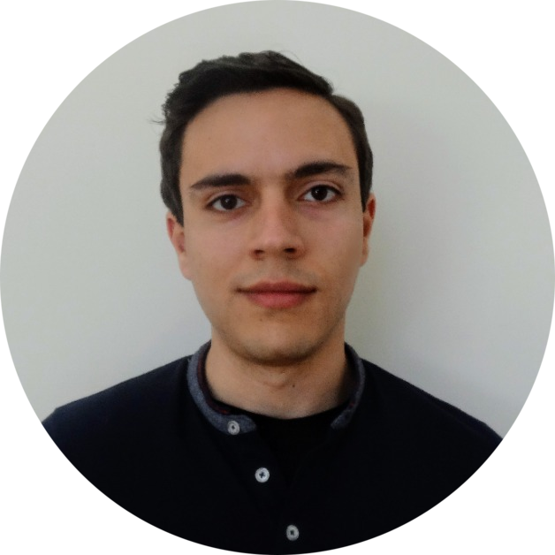

## Who am I?

  

    
  

  

    

      

        <h4>André Ferreira</h4>
      

      
<b>Age:</b>&nbsp;&nbsp;&nbsp;&nbsp;&nbsp;&nbsp;&nbsp;&nbsp;&nbsp;&nbsp;&nbsp;&nbsp;&nbsp;&nbsp;&nbsp;&nbsp;&nbsp;&nbsp;&nbsp;&nbsp;&nbsp;&nbsp;22

      
<b>Sex:</b>&nbsp;&nbsp;&nbsp;&nbsp;&nbsp;&nbsp;&nbsp;&nbsp;&nbsp;&nbsp;&nbsp;&nbsp;&nbsp;&nbsp;&nbsp;&nbsp;&nbsp;&nbsp;&nbsp;&nbsp;&nbsp;&nbsp;Male

      
<b>Location:</b>&nbsp;&nbsp;&nbsp;&nbsp;&nbsp;&nbsp;&nbsp;&nbsp;&nbsp;&nbsp;&nbsp;&nbsp;&nbsp;Lisbon, Portugal

      
<b>Background:</b>&nbsp;&nbsp;&nbsp;&nbsp;&nbsp;&nbsp;&nbsp;Master's in Electrical and Computer Engineering

      
<b>Main Interests:</b>&nbsp;&nbsp;&nbsp;Data Science, Machine Learning, Deep Learning

    

  

Master's student of Electrical and Computer Engineering at Instituto Superior Técnico, as well as curator at TEDxULisboa and an accepted participant in the PyTorch Challenge by Facebook. Besides my interests in fields such as data science, machine learning and robotics, I'm always looking for new challenges and opportunities to learn more, being it self-learning or gaining experience in an international environment. Outside of the professional world, I'm a runner, a traveler, a football fan and an avid music listener.

Currently working on my thesis titled "Predictive Therapy for Rheumatic Diseases Using Interpretable Recurrent Neural Networks". The main goal is to develop a deep learning model that can help predict which medication fits best each rheumatic patient, while also being able to explain the model's decisions.

<a class="button button--secondary button--pill" href="https://andrecnf.github.io/assets/AndreFerreiraCV.pdf">Resume</a>

## What's this page for?

Serves as my personal website, where I share projects I'm working on, discuss data science / machine learning concepts, approach productivity and soft skills, among other topics that I might find interesting to share. You can also find my contacts and other profiles here, on the footer of every page.